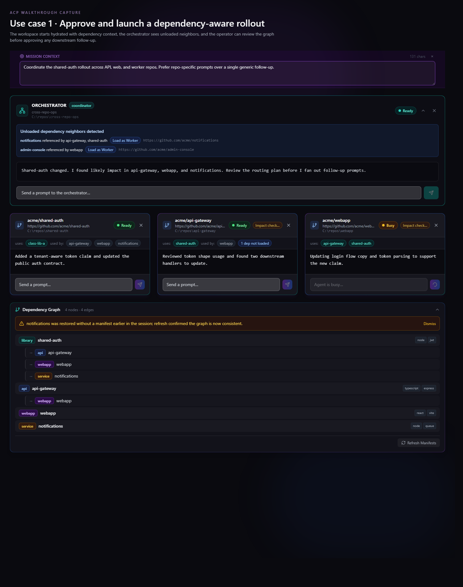
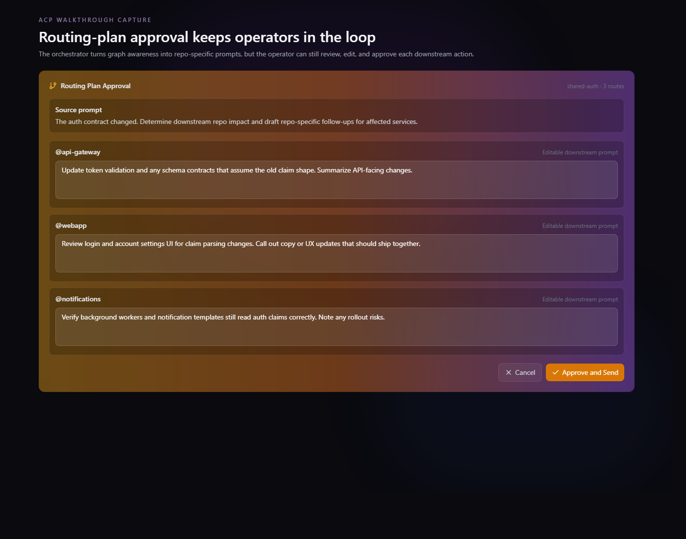
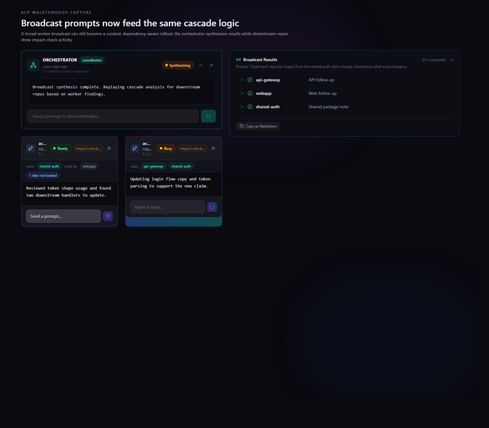
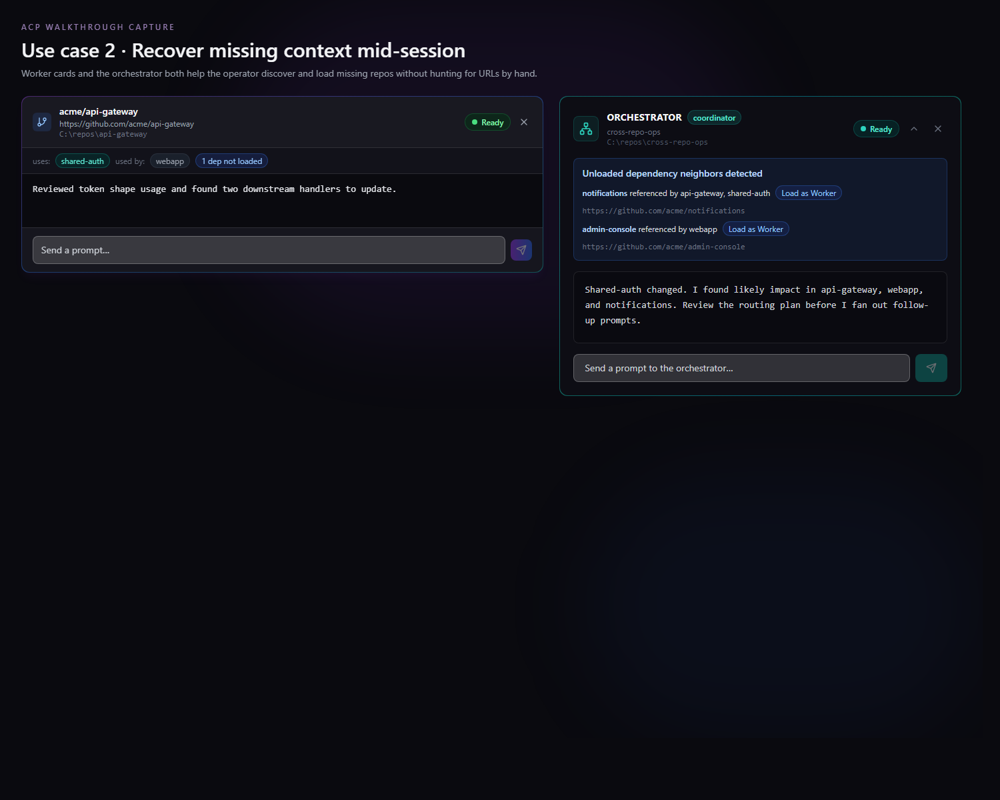
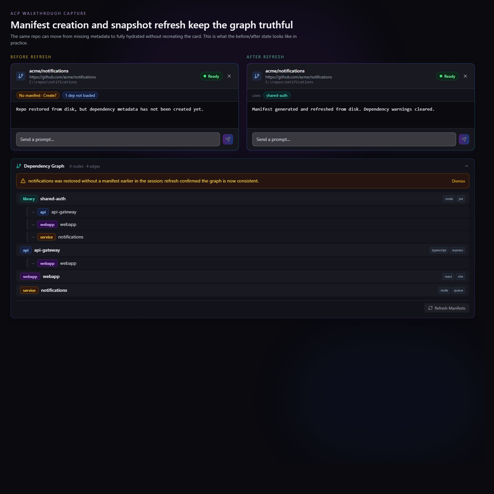
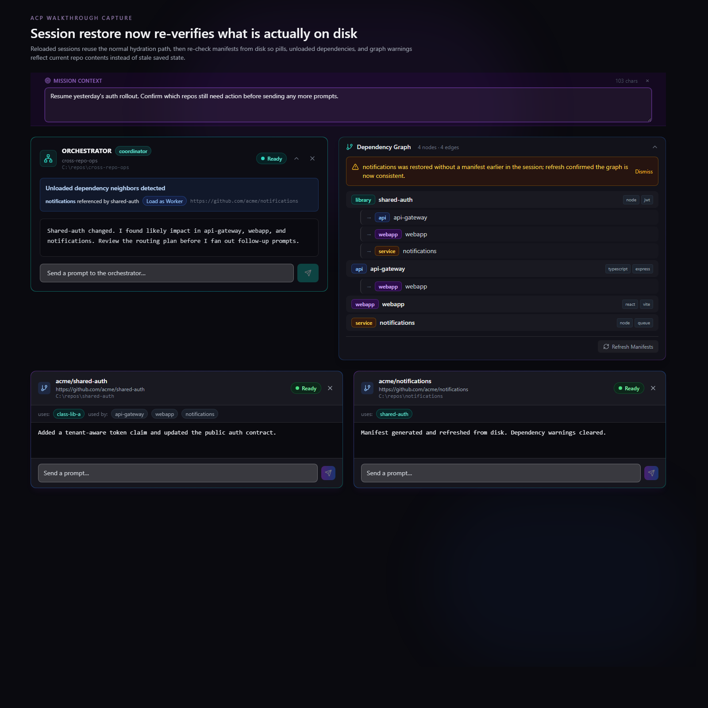

# Walkthrough: Coordinating Cross-Repo Changes with Dependency-Aware Agent Orchestration

This walkthrough shows the biggest dependency-awareness improvements that landed in the ACP Agent Orchestrator today.

The theme is simple: the app now understands more of the repo graph, keeps that understanding fresh, and turns it into guided operator actions instead of leaving the user to stitch everything together manually.

---

## Why this matters

Cross-repo work usually breaks down in one of three places:

- the operator cannot tell which repos depend on which
- the graph goes stale after manifests change
- downstream follow-up work is discovered, but not reviewed or routed cleanly

The improvements in this walkthrough tighten all three loops:

- dependency metadata appears immediately on cards after create or restore
- graph state is refreshed after manifest-changing actions and re-verified on session load
- unloaded dependency neighbors are surfaced with one-click loading help
- orchestrator follow-up plans are reviewable before prompts fan out
- cascades can continue across multiple repos instead of stopping after the first hop

---

## Demo scenario

For the screenshots below, the session uses four repos:

| Repo            | Role in the story                                                |
| --------------- | ---------------------------------------------------------------- |
| `shared-auth`   | Shared auth package where a cross-cutting contract change begins |
| `api-gateway`   | Downstream API surface that validates and exposes the contract   |
| `webapp`        | UI that consumes the API and may need follow-up changes          |
| `notifications` | Background service that was initially missing from the session   |

The operator’s job is to roll out a `shared-auth` change safely, then recover any missing repo context before the rollout drifts.

---

## Use case 1: approve and launch a dependency-aware rollout

This is the highest-value flow in the app today: a change starts in one repo, the orchestrator understands downstream impact, and the operator stays in control of what gets sent where.

### 1. The workspace loads with dependency context already attached

The first improvement is immediate hydration. Worker cards no longer appear as context-free terminals: they arrive with `uses` / `used by` pills, and the dependency graph is already meaningful enough to guide the next decision.

_The orchestrator, workers, and dependency graph now start from the same shared picture of the repo relationships._

### 2. The orchestrator turns graph knowledge into a reviewable routing plan

Once a worker reports a change with cross-repo implications, the orchestrator can draft repo-specific follow-up prompts instead of forcing the operator to rewrite the same idea for each downstream repo.

The key improvement here is that the plan is reviewable before execution.

_Routing plans are no longer implicit. The operator can inspect, edit, approve, or cancel downstream prompts before any cascade begins._

### 3. Broadcast work and single-repo work now converge on the same cascade path

The rollout story also benefits from broadcast cascade parity. A wide worker broadcast can still feed the same dependency-aware orchestration flow as a single-agent prompt.

In practice, that means the operator can ask several repos to audit impact broadly, then let the orchestrator synthesize the results and continue targeted follow-up work across the graph.

_Broadcast results now feed the same downstream reasoning path, while worker cards show impact-check activity during the cascade._

### Why this use case is compelling

Before these changes, the app helped coordinate multiple agents. After these changes, it helps coordinate a multi-repo rollout with real dependency awareness, review gates, and hop-by-hop follow-through.

---

## Use case 2: recover missing context and keep the graph truthful

The second story is about trust. Sessions are long-lived, repos are loaded incrementally, and manifests change. The UI now does a much better job of telling the operator what is missing, what changed, and what has been re-verified.

### 1. Missing repos are surfaced as actionable next steps

When a loaded worker references repos that are not currently in the session, the app no longer leaves that gap implicit.

The worker card can suggest a likely repo URL for `Load as Worker`, and the orchestrator card aggregates unloaded dependency neighbors into one deduplicated summary.

_Both the worker and the orchestrator now help the operator complete the working set, instead of burying missing dependencies in mental overhead._

### 2. Manifest creation and refresh update cards in place

A repo can start with no manifest and still be brought into the dependency-aware workflow cleanly. After manifest creation or sync, the card refreshes in place, new pills appear, and stale warning state can disappear without recreating the whole session.

_This before/after view captures the value of manifest re-parsing, `agent:snapshot` refreshes, graph rebuilds, and stale-flag cleanup._

### 3. Session restore now re-checks reality from disk

Saved sessions are useful only if they remain trustworthy. The restore path now re-reads manifests from disk before re-emitting dependency graph state, so the UI reflects current repo contents rather than only the serialized snapshot.

_Session restore is now a recovery flow, not just a replay flow. The graph and cards are refreshed against what is actually on disk now._

### Why this use case is compelling

This is where the app feels operationally safer. It helps the operator discover missing repos, repair incomplete metadata, and resume work without silently trusting stale state.

---

## What changed under the hood, in operator terms

The screenshots above are backed by a set of improvements that reinforce each other:

- **Manifest hydration on create and restore** means cards can show dependency pills immediately.
- **Manifest re-parse + graph rebuild paths** keep the dependency graph aligned after create-manifest, sync, reverse sync, and explicit refresh actions.
- **`agent:snapshot` refreshes** let existing cards update in place instead of pretending the repo was re-created.
- **Graph-derived bidirectional context** means both `dependsOn` and `dependedBy` relationships can influence impact analysis and routing.
- **Routing-plan approval** adds an operator review gate before downstream prompts fan out.
- **Chained cascades** let follow-up work continue repo-to-repo when the first downstream result reveals more impact.
- **Broadcast cascade parity** gives broad broadcasts the same dependency-aware follow-through as direct prompts.
- **Disk-backed session re-verification** makes restore and refresh flows much more trustworthy.
- **Suggested `Load as Worker` URLs** reduce friction when the session is missing important neighbors.

---

## Operator tips

- Start with the orchestrator and a few obvious workers, then use unloaded dependency hints to complete the graph.
- Refresh manifests after any action that writes or repairs dependency metadata.
- Treat routing plans as reviewable drafts; the biggest value comes from tightening prompts per repo before approval.
- Use the dependency graph as a quick sanity check before and after a cascade.
- On restored sessions, trust the refreshed pills and warnings more than your memory of the previous run.

---

## Takeaway

Today’s improvements move the app from “multi-repo agent control surface” toward a more reliable cross-repo coordination system.

The most important difference is not any single widget. It is that hydration, graph refresh, missing-dependency recovery, routing approval, and cascade follow-through now feel like one connected operator workflow.
